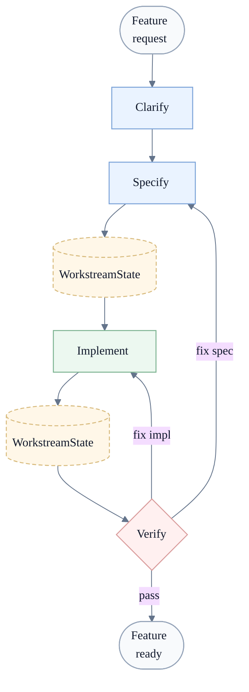

# Devs

A simple workflow for AI-assisted development that does not rely on one long chat, vague scope, or self-approved code.

**Status:** early draft.

If you've used coding agents for real work, you know the pattern.
You ask for a feature.
The model writes something plausible.
Important decisions stay in chat.
The same session that wrote the code says it's done.
Later you find the missing requirements, scope drift, and fake completion.

Devs is an attempt to stop that.

It forces the work through a short loop:

`clarify -> specify -> implement -> verify`



## The actual problem

Most agent workflows fail in the same boring ways:

- the request is vague
- the contract never gets written down
- context turns to soup inside one giant session
- the model quietly expands scope
- `looks done` gets confused with `was checked`

Devs adds structure where AI work usually turns sloppy.

## What Devs is

Devs is not an IDE.
It is not a project management suite.
It is not an autonomous team in a box.

It is a way to run AI-assisted work inside a repo so that:

- the task gets clarified before code starts
- the agreement lives in files, not only in chat
- implementation stays bounded
- verification is independent
- the next session can continue without starting from zero

Each bounded outcome becomes a workstream.
That workstream is the main continuity and delivery unit.
It is the full loop for one target outcome: `clarify -> specify -> implement -> verify`,
including same-target fix loops until the result is truthfully done.

Same-target fix loops stay inside the same workstream.
A new workstream opens only when the target outcome or scope changes materially.
Multiple workstreams may exist in parallel, including during
`clarify/specify`, when they pursue different bounded outcomes.

Each workstream gets one living `state.md`.
A workstream may also carry a `clarification.md` file during
`clarify/specify` when the full technical clarification trail is too large for
chat.
A workstream may also carry a formal `spec.md`, but the formal spec is
optional.

`state.md` stays short and operational.
`clarification.md` does not replace `state.md` or `spec.md`.

`spec-less` work is allowed, but not contract-less work.
If there is no formal spec, the minimal contract still lives in `state.md`.

## Artifact model

Devs uses one hidden system layer and one visible project layer, but it keeps
ownership explicit inside that visible layer:

- `.devs/` for hidden system files and refreshable Devs support files
- `devs/README.md` for the visible Devs-managed artifact map
- `devs/repo.md` for a repo-owned index of local guidance docs Devs should read
- `devs/workstreams/` for living workstream continuity and workstream-local
  artifacts, with one required `state.md` per workstream and optional
  `clarification.md` and `spec.md`

When present, a workstream formal spec may plan `Slice S1..N`.
A slice is a planned unit inside the workstream, not a second workstream.
Repo workstreams use IDs such as `ws-001-some-target`.
Those are related, but they are not the same thing.

Inside one workstream, `stage` means the lifecycle position:

- `clarify/specify`
- `implement`
- `verify`

## This is not vibe coding

Vibe coding is good at getting you to `something exists`.

It is much worse at keeping scope honest, preserving decisions, and proving that a change actually works.

Devs is for the moment when speed is no longer the main problem and trust is.

## The loop

### Clarify
Ask the missing questions first.
Turn a vague request into a real target.

### Specify
Write the contract.
What is in scope.
What is out of scope.
How we will know it is done.

### Implement
Build only the approved slice.
Use tests first.
Leave evidence behind.
Do not self-approve.

### Verify
Check the result in a fresh context.
Re-run the relevant checks.
Return a real verdict: `PASS` or `BLOCKED`.

## Why split the roles?

Because the same context that wrote the code is usually too forgiving when it reviews it.

So Devs separates the jobs:

- a spec author defines the contract
- an implementer builds the slice
- a verifier checks the claim

The workstream state carries the baton between them.
It keeps the current contract, state, evidence, findings, next owner, and next action in the repo instead of burying them in chat history.

## Who this is for

Use Devs if AI helps you start fast but keeps making the finish messy.

Skip it if you are happy doing everything in one long chat and do not care much about explicit contracts, workstream continuity, or independent verification.

## Installation

Copy-paste this to your agent:

```text
Install Devs in this repository using this source https://raw.githubusercontent.com/EvMossan/devs/main/install/INSTALL.md
```

## Updating

Use the same bootstrap entrypoint when Devs is already installed:

```text
Refresh the existing Devs install in this repository using this source https://raw.githubusercontent.com/EvMossan/devs/main/install/INSTALL.md
```

Refresh is install-or-refresh, not blind reinstall.
It should refresh Devs-managed files, patch shared bootstrap files minimally,
preserve repo-owned visible artifacts, and never overwrite `devs/repo.md`
after that file has been created.
